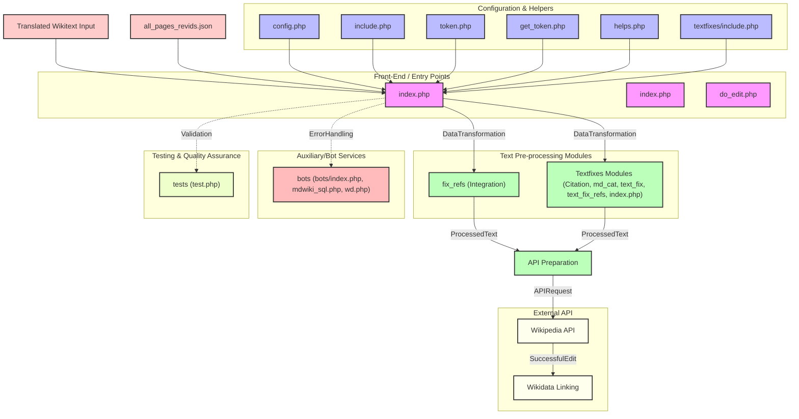

# Wikipedia Article Publishing Workflow

## Overview
This project is a PHP-based workflow designed to manage the final steps for publishing Wikipedia articles translated via the ContentTranslation tool. The system pre-processes wikitext, prepares API requests, and publishes articles while also linking them to Wikidata after successful edits.

## Features
- **Wikitext Pre-Processing**: Cleans and standardizes Wikipedia articles using `fix_refs` and `textfixes` components.
- **Automated Publishing**: Constructs API requests and submits edits to Wikipedia.
- **Wikidata Integration**: Links newly published articles to corresponding Wikidata items.
- **Logging and Reporting**: Maintains logs of published edits and errors.
- **Automation Support**: Includes bot components for additional auxiliary tasks.
- **Configuration Management**: Uses centralized config files for easy management.
- **Testing Suite**: Ensures reliability with test cases.

## System Architecture
### Core Components
1. **Entry Point / Controller**
   - `index.php`: Orchestrates the workflow, initiating the publishing process.

2. **Pre-Processing Module** (Wikitext Processing)
   - `fix_refs` directory
   - `textfixes` directory (including `textfixes/text_fix.php`, `textfixes/text_fix_refs.php`)

3. **API Preparation & Processing Module** (API interaction with Wikipedia)
   - `do_edit.php`: Handles article editing requests.
   - `get_token.php`: Manages authentication and token retrieval.
   - `token.php`: Assists with authentication handling.

4. **Bot/Automation Components**
   - `bots/` directory:
     - `bots/index.php`
     - `bots/mdwiki_sql.php`
     - `bots/wd.php`

5. **Reporting & Logging Module**
   - `publish_reports/` directory:
     - `publish_reports/index.php`
   - `text_changes.php`: Tracks and logs text modifications.

6. **Configuration and Dependency Management**
   - `config.php`: Stores global settings and configurations.
   - `include.php`: Centralized helper functions for shared use.

7. **Testing Suite**
   - `tests/` directory:
     - `tests/test.php`

## Workflow
1. `index.php` starts execution (via web request or scheduled task).
2. Reads external JSON file (`all_pages_revids.json`) to retrieve revision IDs.
3. Generates an edit summary using `make_summary`.
4. Sends the wikitext through `fix_refs` and `textfixes` for cleanup and standardization.
5. API request parameters are prepared (`prepareApiParams`).
6. The system processes edits (`processEdit`) and submits them to Wikipedia.
7. On successful edit, `handleSuccessfulEdit` links the article to Wikidata.
8. Additional bot scripts (`bots/`) and reporting modules (`publish_reports/`) run as needed.
9. Error handling and logging mechanisms track and resolve issues (`handleNoAccess`).

## Design Principles
- **Layered Architecture**: Separation of concerns between controllers, business logic, external integrations, and auxiliary modules.
- **Modular Design**: Reusable helper functions and configuration management.
- **Automation-Friendly**: Bots and scripts streamline workflows.
- **API-Driven**: Integrates with MediaWiki API and Wikidata for seamless publishing.

## Technologies Used
- **PHP** (Primary language)
- **MediaWiki API** (For Wikipedia publishing)
- **Wikidata API** (For article linking)
- **GitHub Actions** (For automation and workflow management)

## Diagram

